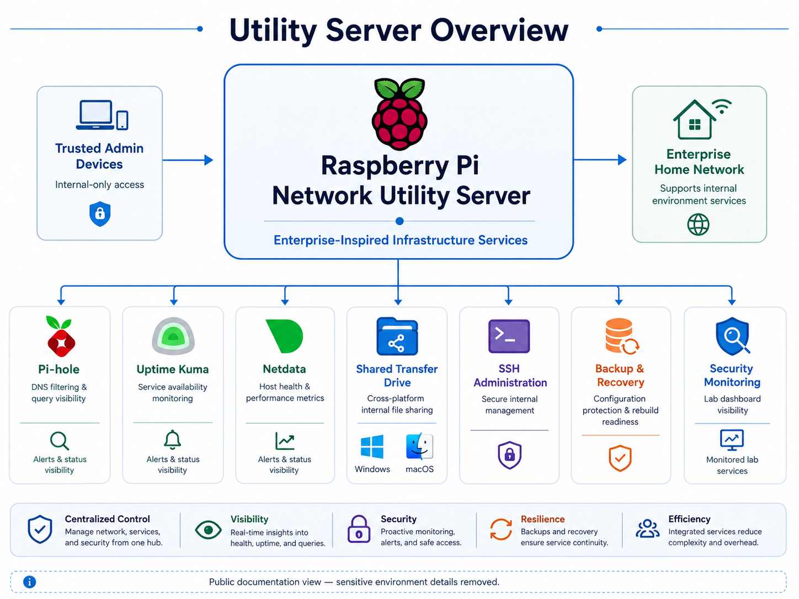
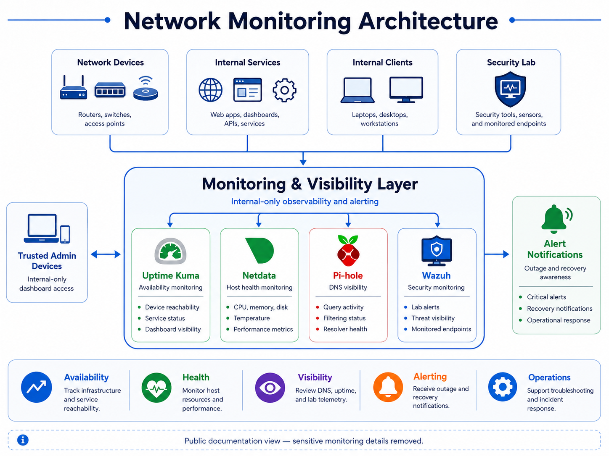
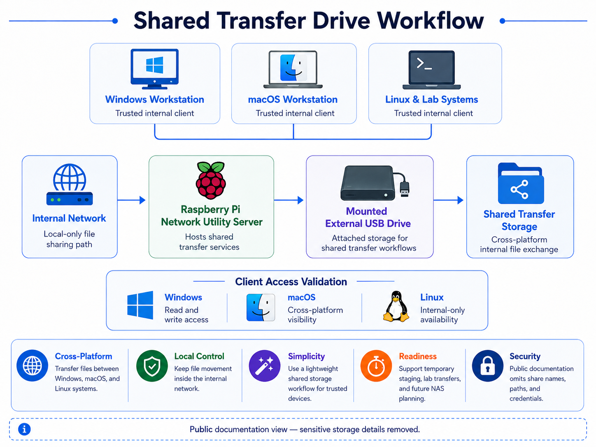
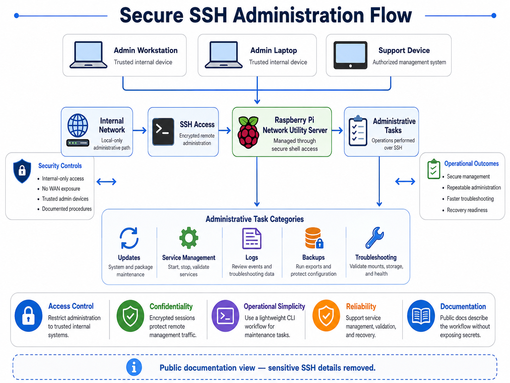
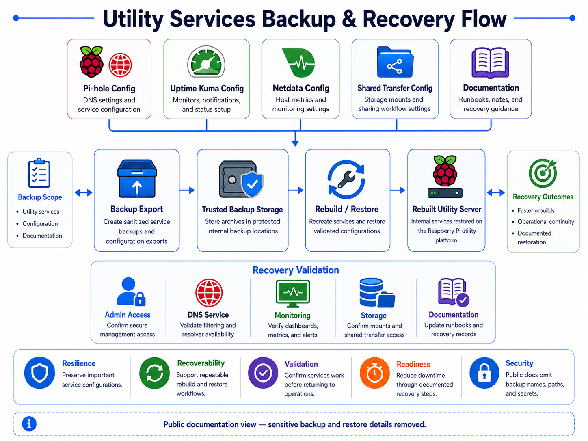
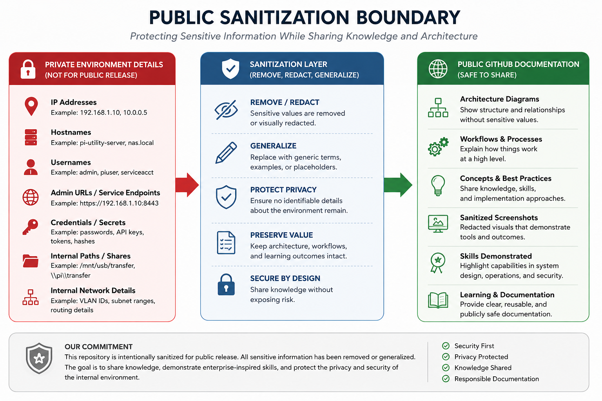

<h1 align="center">Raspberry Pi Network Utility Server</h1>

<h3 align="center">
Enterprise-Inspired Network Architecture Project
</h3>

Designing, securing, monitoring, and documenting a Raspberry Pi-based internal utility server used for DNS filtering, uptime monitoring, host health visibility, secure administration, shared file transfer workflows, and backup support.

---

# Project Gallery

| Utility Server Overview | Network Monitoring Architecture |
|---|---|
|  |  |

| Shared Transfer Drive Workflow | Secure SSH Administration Flow |
|---|---|
|  |  |

| Backup and Recovery Flow | Public Sanitization Boundary |
|---|---|
|  |  |

---

# Overview

The Raspberry Pi Network Utility Server is a focused infrastructure services project built as part of an [enterprise-inspired home network environment](https://github.com/khucker3d/enterprise-infrastructure-architecture-public/blob/main/README.md).

Rather than treating the Raspberry Pi as a single-purpose device, this project uses it as an internal utility server for lightweight operational services, monitoring visibility, DNS filtering, secure administration, shared transfer storage, and backup support.

This repository is intentionally sanitized for public release. Sensitive implementation details such as internal IP addresses, hostnames, usernames, credentials, service URLs, and environment-specific paths have been removed or generalized.

The goal of this system is to provide lightweight, reliable, and maintainable infrastructure services without exposing sensitive internal details publicly.

### Services Supported

The Raspberry Pi utility server supports the following internal functions:

* DNS filtering and local network visibility
* Infrastructure uptime monitoring
* Lightweight system health monitoring
* Secure remote administration using SSH
* Shared file transfer workflows using attached external storage
* Backup and recovery support for utility services

### Engineering Goals

This project was designed around the following operational goals:

* Keep utility services internal-only
* Avoid unnecessary WAN exposure
* Use secure administrative access
* Document repeatable setup and recovery procedures
* Separate public documentation from private implementation details
* Support future expansion into NAS, backup, and infrastructure automation workflows

### Security Considerations

This public version intentionally omits sensitive implementation details, including:

* Internal IP addresses
* Hostnames
* Usernames
* SSH keys
* File paths
* Share names
* Firewall rule specifics
* Device serial numbers
* MAC addresses
* Administrative URLs

The purpose of this documentation is to demonstrate infrastructure design, operational planning, and security-aware administration without exposing the live environment.

## [Operation Docs & Runbook Examples:](https://github.com/khucker3d/raspberry-pi-network-utility-server-public/tree/main/docs/operations)
**Documentation Scope:** This public repository contains a high-level, sanitized overview of the project. More detailed internal documentation exists separately, including step-by-step walkthroughs, configuration procedures, validation steps, troubleshooting notes, and operational runbooks. Sensitive environment-specific details have been intentionally excluded for security reasons.

